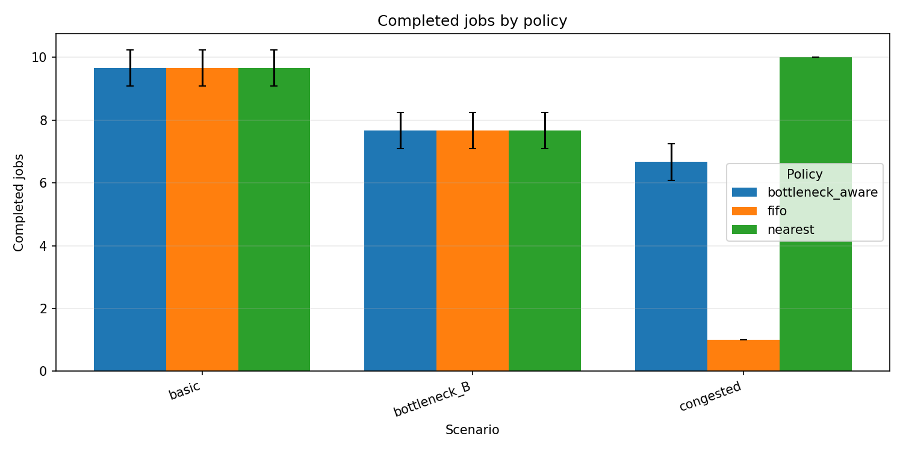
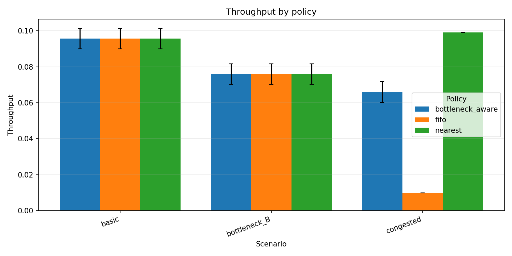
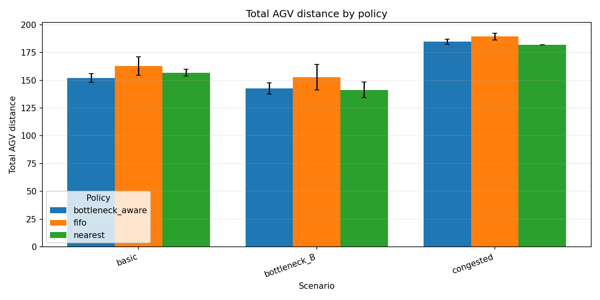
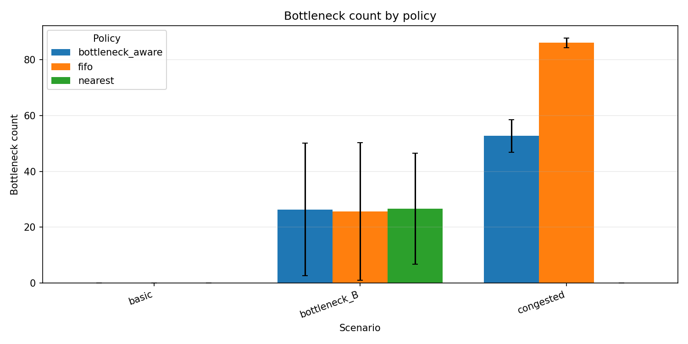
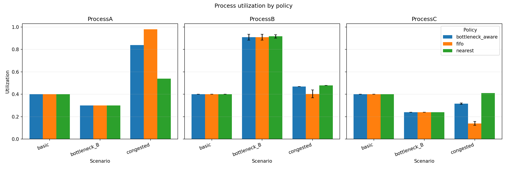
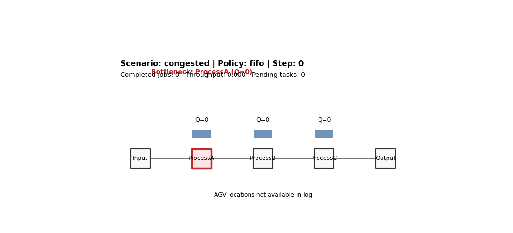
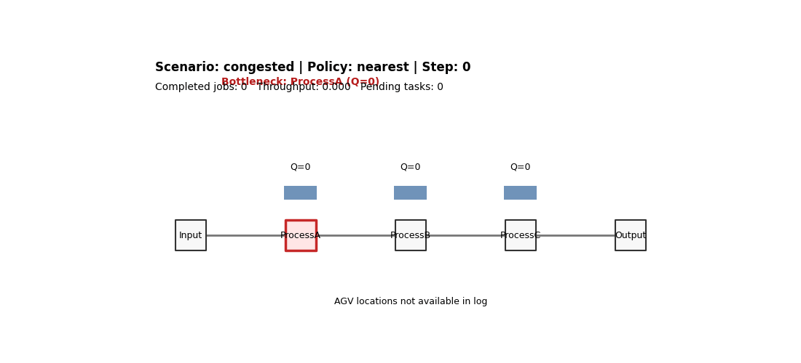

# Smart Factory Digital Twin RL

This repository contains a Python-based 2D smart factory digital twin simulator for analyzing AGV dispatching policies under bottleneck and congestion scenarios. The current project is an MVP and preliminary research experiment focused on comparing simple dispatching baselines with a bottleneck-aware policy using repeatable scenario configs, step-level logs, summary tables, plots, and lightweight animations.

## Research Motivation

AGV dispatching decisions affect factory throughput, waiting time, travel distance, and bottleneck formation. A FIFO policy is simple and interpretable, but it ignores AGV distance and process-level bottlenecks. A nearest-job policy can reduce AGV travel distance, but it may still send jobs into congested process stations. A bottleneck-aware policy attempts to use process queue information so dispatching decisions can relieve congested stations and avoid worsening active bottlenecks.

## Current MVP Scope

- 2D factory flow: `Input -> ProcessA -> ProcessB -> ProcessC -> Output`
- 1 to 3 AGVs
- Job generation
- Process queues and fixed processing times
- FIFO, nearest-job, and bottleneck-aware dispatch policies
- Step-level simulation logs
- Policy comparison summary tables
- Report-ready comparison plots
- Lightweight 2D GIF animation for inspecting queue and bottleneck dynamics

## Experiment Scenarios

- `basic`: ProcessA, ProcessB, and ProcessC have similar processing times.
- `bottleneck_B`: ProcessB has a larger processing time, creating a controlled bottleneck.
- `congested`: jobs arrive with a high probability, increasing queue pressure.
- `agv_1`, `agv_2`, `agv_3`: AGV count variation configs for capacity sensitivity checks.

## Policies Compared

- `FIFO`: selects the oldest pending transport task.
- `nearest-job`: selects the task with the nearest pickup location.
- `bottleneck-aware`: uses a preliminary bottleneck score based on process queue state, favoring tasks that relieve the bottleneck and penalizing tasks that send more work into it.

## Metrics

- `completed_jobs`
- `throughput`
- `pending_tasks`
- total AGV distance
- AGV utilization
- process utilization
- average queue length
- bottleneck count

## Key Preliminary Results

The current MVP results should be interpreted as an initial baseline, not a final performance claim. In the `basic` scenario, policy differences are small because process times and queue pressure are relatively balanced. In the `bottleneck_B` scenario, ProcessB utilization becomes high, confirming that the scenario creates the intended bottleneck. In the `congested` scenario, nearest-job achieved higher `completed_jobs` than FIFO, while bottleneck-aware improved over FIFO but did not always outperform nearest-job. Future work will refine these findings with additional seeds, better bottleneck-aware scoring, and richer dispatching metrics.

## Result Figures











## Animation Examples





## How To Run

```powershell
python -m venv .venv
.\.venv\Scripts\activate
pip install -r requirements.txt
python scripts/run_simulation.py --config config/basic.yaml --policy fifo
python scripts/compare_policies.py --seeds 42 43 44
python scripts/generate_plots.py
python scripts/generate_animation.py --log data/logs/step_log_congested_fifo_seed42.csv
```

## Repository Structure

- `config/`: scenario and experiment configuration files.
- `src/simulator/`: core 2D factory simulation entities and environment.
- `src/policies/`: FIFO, nearest-job, and bottleneck-aware AGV dispatch policies.
- `src/visualization/`: plotting and animation utilities.
- `scripts/`: command-line entry points for runs, comparisons, plots, and animations.
- `data/logs/`: step-level simulation logs.
- `results/tables/`: run-level and aggregated policy comparison CSV files.
- `results/figures/`: report-ready policy comparison plots.
- `results/animations/`: lightweight 2D GIF animations.

## Future Work

- Improve bottleneck-aware policy scoring.
- Add more robust repeated experiments with broader seed sets.
- Add bottleneck prediction using time-series models.
- Add a Gymnasium-compatible reinforcement learning environment.
- Evaluate DQN/PPO-based AGV dispatching.
- Extend toward a 3D digital twin visualization.
- Explore constrained-space and space logistics extensions.
